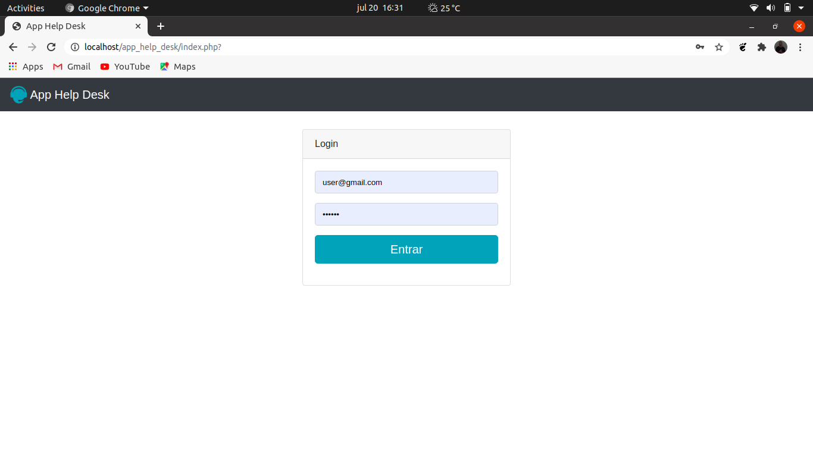

# Help Desk

Help Desk is a project that was developed to practice my initial knowledge of PHP.
The project has a login screen, where user authentication is performed. According to each user different contents are presented.

O Help Desk é um projeto que foi desenvolvido para colocar em prática conhecimentos iniciais na linguagem PHP.
O projeto conta uma tela de login, onde é feita a autenticação do usuário, de acordo com cada usuário conteúdos diferentes são apresentados.

<h3>Tela de login / Login screen </h3>

<h3>Tela de abertura de chamado</h3>

